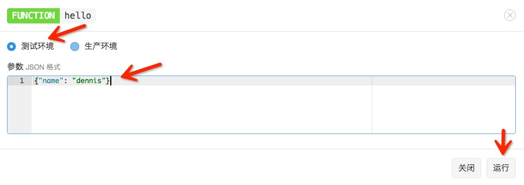
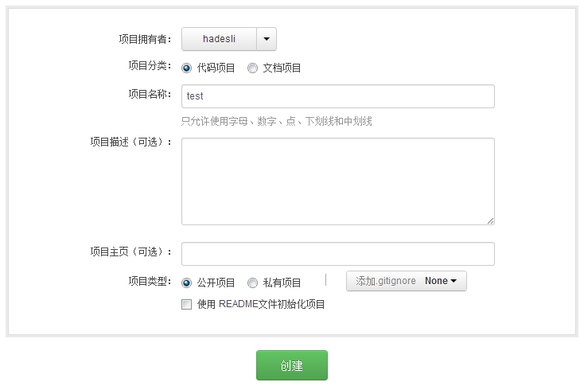
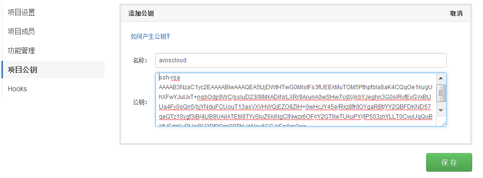
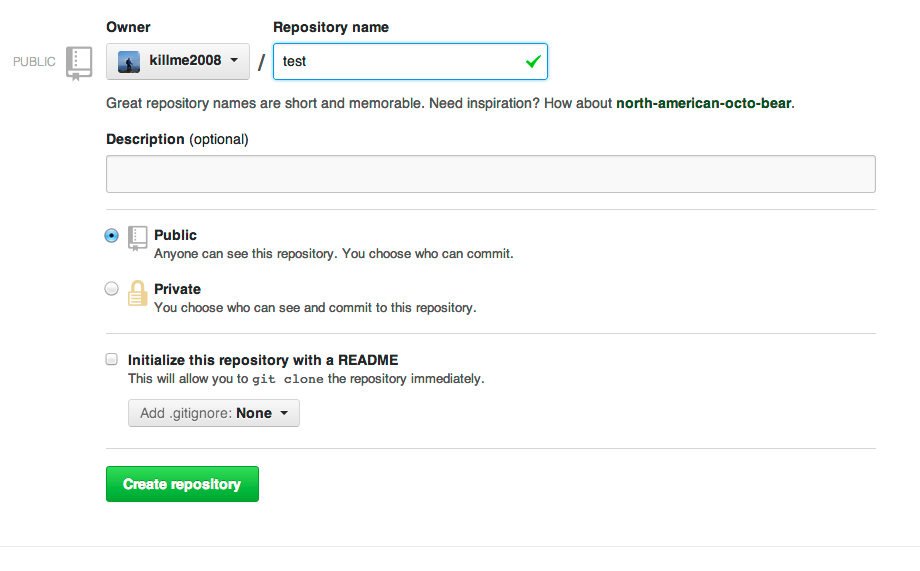
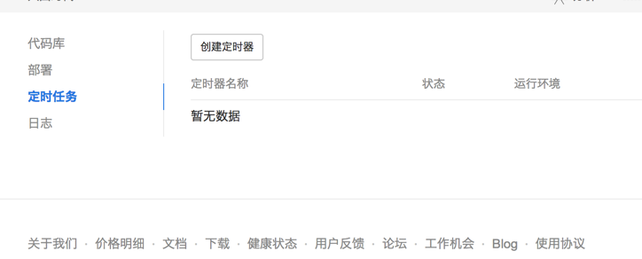
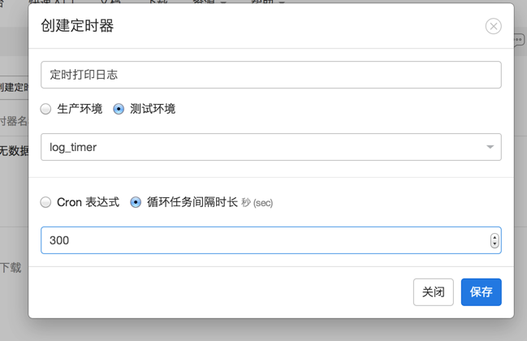

# 云引擎指南


## 云代码 2.0 环境已不推荐使用

### 如何判断当前运行环境
如果项目中有 `cloud/main.js` 文件，即为云代码 2.0 环境，该环境以后不会增加任何新功能，我们强烈建议你升级到 LeanEngine 环境。

### 升级到 LeanEngine

云代码 2.0 和 LeanEngine 的差别主要是应用的目录结构：因为 LeanEngine 没有沙箱环境，所以不强制 `cloud` 和 `config` 等目录结构，只要是一个普通的 Node.js 项目即可。而 SDK 将作为一个普通组件添加到项目中，所以使用方面也有一些变化：

* 需要自己初始化 AV 对象：云代码 2.0 的环境会直接将 AV 对象初始化并保存在沙箱环境上下文中，所以不需要任何声明而直接使用。我们认为这样违背了编程规则，所以 LeanEngine 环境需要自行初始化 AV 对象，而且可以根据需要来决定此过程是否使用 masterKey 。
* 时区：云代码 2.0 默认使用 UTC 时区，这给很多开发者带来了困惑。所以 LeanEngine 默认情况使用东八区时区，在 [时区问题](#时区问题) 部分详细讨论这个问题。
* `avos-express-cookie-session` 的改变：该组件不再依赖 `cookie-parse`，而且引入方式发生变化，详情见 [处理用户登录和登出](#处理用户登录和登出)。
* 运行环境判断：云代码 2.0 使用 `__production` 全局变量判断当前环境是「测试环境」还是「生产环境」，而 LeanEngine 尊重 Node.js 的习惯，使用 `NODE_ENV` 这个变量来进行区分，`test` 为测试环境，`production` 为生产环境。详情见 [运行环境区分](#运行环境区分)

请参见详细的 [升级指南](leanengine_upgrade_3.html)。


## 介绍

云引擎允许你编写 JavaScript 或者 Python 代码，并部署到我们的云端，通过拦截 save 请求，在保存对象之前或之后做一些事情；你可以自定义业务函数，并通过 SDK 调用；你还可以调用部分第三方库来实现自己的业务逻辑，甚至还可以将整个网站架设在云引擎之上，我们提供了网站托管服务。

现在我们将「云代码 2.0」的功能做了升级，开放性更高，并且更名为「云引擎 - LeanEngine」。老的云代码产品将在一段时间内继续运行并且维护下去，但是云代码上的所有功能都能在云引擎上 实现，并且自由度更高，因此我们强烈建议将项目改由云引擎来实现。

### 与云代码的区别

* **标准的运行环境**：之前云代码是我们订制的一个沙箱运行环境，功能受限，并且代码只可以在云代码环境运行，难以迁移到自己搭建的后端服务器上。而云引擎环境可以部署标准项目。
* **多语言支持**：目前支持 Node.js 与 Python，将来会支持更多的编程语言运行环境。

### 命令行工具

使用命令行工具可以非常方便地部署和发布云引擎项目，查看项目状态和查看日志，甚至支持多应用部署。具体请参考 [命令行工具指南](cloud_code_commandline.html)。

## Demo


* [cloudcode-test](https://github.com/killme2008/cloudcode-test)：一个简单留言板网站。效果体验：https://myapp.avosapps.com/


## 快速入门

首先确认本机已经安装了相关的运行环境和 [命令行工具](cloud_code_commandline.html)。

### 创建应用


命令行界面输入命令创建应用：

```
$ avoscloud new
```

根据提示信息输入 appId 等相关信息即可创建一个初始应用。然后进入项目目录：

```
$ cd <appName>
```


### 本地运行


```
$ avoscloud
```


应用即可启动运行：<http://localhost:3000>

可以通过下列命令确认云函数工作正常，该函数定义在 `$PROJECT_DIR/cloud/main.js` 文件中：

```sh
curl -X POST -H "Content-Type: application/json; charset=utf-8"   \
       -H "X-LC-Id: {{appid}}"          \
       -H "X-LC-Key: {{appkey}}"        \
       -H "X-LC-Prod: 0"  -d '{}' \
       http://localhost:3000/1.1/functions/hello
```

如果需要指定 web 服务端口，可以增加 `-P` 参数。获取帮助信息请使用 `-h` 参数。

### 部署的到云引擎

部署到测试环境：

```
$ avoscloud deploy
```

如果你设置了 [二级域名](#设置域名)，即可通过 `http://dev.${your_app_domain}.avosapps.com` 访问你应用的测试环境。

部署到生产环境：

```
$ avoscloud publish
```

如果你设置了 [二级域名](#设置域名)，即可通过 `http://${your_app_domain}.avosapps.com` 访问你应用的生产环境。

通过下列命令可以确认云函数在云引擎上工作正常：

```sh
curl -X POST -H "Content-Type: application/json; charset=utf-8"   \
       -H "X-LC-Id: {{appid}}"          \
       -H "X-LC-Key: {{appkey}}"        \
       -H "X-LC-Prod: 1"  -d '{}' \
       https://leancloud.cn/1.1/functions/hello
```

## 使用云引擎中间件

如果你没有使用项目框架，则需要自己安装和初始化云引擎中间件。

### 环境变量

你可以在代码中使用以下与云引擎平台相关的环境变量：

变量名|说明
---|---
LC_APP_ID|当前应用的 App Id
LC_APP_KEY|当前应用的 App Key
LC_APP_MASTER_KEY|当前应用的 Master Key
LC_APP_ENV|当前应用环境：<ul><li>开发环境没有该环境变量，或值为 `development`</li><li>测试环境值为 `stage`</li><li>生产环境值为 `production`</li></ul>
LC_APP_PORT|当前应用开放给外网的端口，只有监听此端口，用户才可以访问到你的服务。

**提示**：如果在客户端想调用云引擎的测试环境，各个 SDK 都有类似于 `setProduction` 的方法，比如 [JS-SDK AV.setProduction(production)](https://leancloud.cn/docs/api/javascript/symbols/AV.html#.setProduction)，其中 production 设置为 `0` 则该 SDK 将请求测试环境；设置为 `1` 将请求生产环境，默认为 `1`。

### 安装


因为云代码 2.0 是运行在沙箱环境，所以不需要安装和初始化，直接可以在项目中使用。


### 使用数据存储

你可以直接在云引擎上使用我们的 [数据存储](https://leancloud.cn/features/storage.html) 服务，相关功能请参考 [JavaScript SDK](./js_guide.html)。

##云函数

当你开发移动端应用时，可能会有下列需求：

* 应用有 Android、iOS 甚至 Windows Phone 客户端，但是很多业务逻辑都是一样的，你希望能将这部分逻辑抽取出来，只维护一份。
* 有些逻辑希望能够较灵活的调整（比如某些个性化列表的排序规则），但又不想频繁的更新和发布移动客户端。
* 有些逻辑需要的数据量很大，或者运算成本高（比如某些统计汇总需求），你不希望在移动客户端进行运算，因为这样会消耗大量的网络流量和手机运算能力。
* 你希望能在特定操作时触发一段逻辑（我们称为 Hook 函数），比如：用户注册后对该用户增加一些信息记录用于统计；或某业务数据发生变化后希望做一些别的业务操作。这些代码不适合放在移动客户端（比如因为上面提到的几个原因）。
* 你希望有能有定时任务，比如每天凌晨清理垃圾注册账号等等。

这时，你可以使用云引擎的云函数。云函数是一段部署在服务端的代码，编写 JavaScript 或者 Python 代码，并部署到我们的平台上，可以很好的完成上述需求。

你可以使用 [在线定义函数](#在线定义函数) 或者 [项目定义函数](#项目定义函数) 来开发云函数：前者很方便快捷，不需要涉及项目依赖、部署等问题；后者可以提供更为强大的灵活性和自主性。

示例项目中 `$PROJECT_DIR/cloud/main.js` 文件定义了一个很简单的 `hello` 云函数。现在让我们看一个明显较复杂的例子来展示云引擎的用途。在云端进行计算的一个重要理由是，你不需要将大量的数据发送到设备上做计算，而是将这些计算放到服务端，并返回结果这一点点信息就好。

例如，你写了一个应用，让用户对电影评分，一个评分对象大概是这样：

```json
{
  "movie": "夏洛特烦恼",
  "stars": 5,
  "comment": "夏洛一梦，笑成麻花"
}
```

`stars` 表示评分，1-5。如果你想查找《夏洛特烦恼》这部电影的平均分，你可以找出这部电影的所有评分，并在设备上根据这个查询结果计算平均分。但是这样一来，尽管你只是需要平均分这样一个数字，却不得不耗费大量的带宽来传输所有的评分。通过云引擎，我们可以简单地传入电影名称，然后返回电影的平均分。

云函数接收 JSON 格式的请求对象，我们可以用它来传入电影名称。整个 [JavaScript SDK](./js_guide.html) 都在云引擎运行环境上有效，可以直接使用，所以我们可以使用它来查询所有的评分。结合一起，实现 `averageStars` 函数的代码如下:


```javascript
AV.Cloud.define('averageStars', function(request, response) {
  var query = new AV.Query('Review');
  query.equalTo('movie', request.params.movie);
  query.find({
    success: function(results) {
      var sum = 0;
      for (var i = 0; i < results.length; ++i) {
        sum += results[i].get('stars');
      }
      response.success(sum / results.length);
    },
    error: function() {
      response.error('movie lookup failed');
    }
  });
});
```


`averageStars` 和 `hello` 函数的唯一区别是在调用函数时，我们必须给 `request.params.movie` 提供参数。接下来，我们将介绍如何调用云函数。

### 调用云函数

云函数可以被各种客户端 SDK 调用（详见各 SDK 的「调用云代码」部分），也可以通过 REST API 来调用。例如，用一部电影名称去调用 `averageStars` 函数：

```sh
curl -X POST -H "Content-Type: application/json; charset=utf-8" \
       -H "X-LC-Id: {{appid}}" \
       -H "X-LC-Key: {{appkey}}" \
       -H "X-LC-Prod: 0" \
       -d '{"movie":"The Matrix"}' \
https://leancloud.cn/1.1/functions/averageStars
```


有两个参数会被传入到Cloud函数：

* request - 包装了请求信息的请求对象，下列这些字段将被设置到request对象内:
 * params - 客户端发送的参数对象
 * user - `AV.User` 对象，发起调用的用户，如果没有登录，则不会设置此对象。如果通过 REST API 调用时模拟用户登录，需要增加一个头信息 `X-AVOSCloud-Session-Token: <sessionToken>`，该 `sessionToken` 在用户登录或注册时服务端会返回。
* response - 应答对象，包含两个函数：
 * success - 这个函数可以接收一个额外的参数，表示返回给客户端的结果数据。这个参数对象可以是任意的JSON对象或数组，并且可以包含`AV.Object`对象。
 * error - 如果这个方法被调用，则表示发生了一个错误。它也接收一个额外的参数来传递给客户端，提供有意义的错误信息。


如果函数调用成功，云端返回给客户端的结果类似这样：

```json
{
  "result": 4.8
}
```

如果调用有错误，则返回：

```json
{
  "code": 141,
  "error": "movie lookup failed"
}
```

#### 调用已定义的函数

在云引擎中也可以使用 `AV.Cloud.run` 调用 `AV.Cloud.define` 定义的云函数：


```javascript
AV.Cloud.run('hello', {name: 'dennis'}, {
  success: function(data){
      //调用成功，得到成功的应答data
  },
  error: function(err){
      //处理调用失败
  }
});
```


API 参数详解参见 [AV.Cloud.run](api/javascript/symbols/AV.Cloud.html#.run)。

### Save 前执行操作

在某些情况下，你可能不想简单地丢弃无效的数据，而是想先清理一下再保存，`beforeSave` 可以帮你做到这一点。

在我们电影评分的例子里，你可能想保证评论不要过长，太长的单个评论可能难以显示。我们可以使用 `beforeSave` 来截断评论到 140 个字符：


```javascript
AV.Cloud.beforeSave('Review', function(request, response) {
  var comment = request.object.get('comment');
  if (comment) {
    if (comment.length > 140) {
      // 截断并添加...
      request.object.set('comment', comment.substring(0, 137) + '...');
    }
    // 保存到数据库中
    response.success();
  } else {
    // 不保存数据，并返回错误
    response.error('No comment!');    
  }
});
```


### Save 后执行操作

如果想在保存对象后做一些动作，如发送一条推送通知，则可以通过 `afterSave` 函数来实现。例如，当一条留言保存后再更新一下这篇帖子的评论总数：


```javascript
AV.Cloud.afterSave('Comment', function(request) {
  query = new AV.Query('Post');
  query.get(request.object.get('post').id, {
    success: function(post) {
      post.increment('comments');
      post.save();
    },
    error: function(error) {
      throw 'Got an error ' + error.code + ' : ' + error.message;
    }
  });
});
```


在用户注册成功之后如果你想做一些事情可以定义以下函数：


```javascript
AV.Cloud.afterSave('_User', function(request) {
  //输出信息请到「应用控制台 > 存储 > 云引擎 > 日志」中查看
  console.log(request.object);
  request.object.set('from','LeanCloud');
  request.object.save(null,{success:function(user)
    {
      console.log('ok!');
    },error:function(user,error)
    {
      console.log('error',error);
    }
    });
});
```


如果`afterSave`函数调用失败，save请求仍然会返回成功应答给客户端。`afterSave`发生的任何错误，都将记录到云引擎日志里。

### 在 update 更新前执行操作


云代码 2.0 没有支持这个 Hook, 你需要升级到 LeanEngine 来使用它，请参见详细的 [升级指南](leanengine_upgrade_3.html)。


### 在 update 更新后执行动作

你还可以在在更新对象后执行特定的动作，这是通过 `afterUpdate` 函数实现的。比如每次修改文章后简单地记录日志：


```javascript
AV.Cloud.afterUpdate('Article', function(request) {
   console.log('Updated article,the id is :' + request.object.id);
});
```


### 在 delete 前执行动作

很多时候，你希望在删除一个对象前做一些检查工作。比如你要删除一个相册(Album)前，会去检测这个相册里的图片(Photo)是不是已经都被删除了，这都可以通过`beforeDelete`函数来定义一个钩子（callback）函数来做这些检查，示例代码：


```javascript
AV.Cloud.beforeDelete('Album', function(request, response) {
  //查询Photo中还有没有属于这个相册的照片
  query = new AV.Query('Photo');
  var album = AV.Object.createWithoutData('Album', request.object.id);
  query.equalTo('album', album);
  query.count({
    success: function(count) {
      if (count > 0) {
        //还有照片，不能删除，调用error方法
        response.error('Can\'t delete album if it still has photos.');
      } else {
        //没有照片，可以删除，调用success方法
        response.success();
      }
    },
    error: function(error) {
      response.error('Error ' + error.code + ' : ' + error.message + ' when getting photo count.');
    }
  });
});
```


### 在 delete 后执行动作

另一些情况下，你可能希望在一个对象被删除后执行操作，例如递减计数、删除关联对象等。同样以相册为例，这次我们不在beforeDelete中检查是否相册中还有照片，而是在相册删除后，同时删除相册中的照片，这是通过`afterDelete`函数来实现：


```javascript
AV.Cloud.afterDelete('Album', function(request) {
  query = new AV.Query('Photo');
  var album = AV.Object.createWithoutData('Album', request.object.id);
  query.equalTo('album', album);
  query.find({
    success: function(posts) {
    //查询本相册的照片，遍历删除
    AV.Object.destroyAll(posts);
    },
    error: function(error) {
      console.error('Error finding related comments ' + error.code + ': ' + error.message);
    }
  });
});
```


### 用户验证通知函数

很多时候，你希望在用户通过邮箱或者短信验证的时候对该用户做一些其他操作，可以增加`onVerified`函数：


```javascript
AV.Cloud.onVerified('sms', function(request, response) {
    console.log('onVerified: sms, user: ' + request.object);
    response.success();
```


函数的第一个参数是验证类型：短信验证为`sms`，邮箱验证为`email`。另外，数据库中相关的验证字段，如`emailVerified`不需要修改，我们已经为你更新完成。

### 用户登录时执行动作

有些时候你可能需要禁止一些用户登录（比如黑名单内的用户），可以定义以下函数：


```javascript
AV.Cloud.onLogin(function(request, response) {
  // 因为此时用户还没有登录，所以用户信息是保存在 request.object 对象中
  console.log("on login:", request.object);
  if (request.object.get('username') == 'noLogin') {
    // 如果是 error 回调，则用户无法登录（收到 401 响应）
    response.error('Forbidden');
  } else {
    // 如果是 success 回调，则用户可以登录
    response.success();
  }
});
```


### 错误响应码


```
AV.Cloud.define('errorCode', function(req, res) {
  AV.User.logIn('NoThisUser', 'lalala', {
    error: function(user, err) {
      res.error(err);
    }
  });
});
```


客户端收到的响应：`{"code":211,"error":"Could not find user"}`


```
AV.Cloud.define('customErrorCode', function(req, res) {
  res.error({code: 123, message: 'custom error message'});
});
```


客户端收到的响应： `{"code":123,"error":"custom error message"}`

## 发送 HTTP 请求


LeanEngine 允许你使用 `AV.Cloud.httpRequest` 函数来发送 HTTP 请求到任意的 HTTP 服务器。不过推荐你使用 [request](https://www.npmjs.com/package/request) 等第三方模块来处理 HTTP 请求。

使用 `AV.Cloud.httpRequest` ，一个简单的 GET 请求看起来是这样：

```javascript
AV.Cloud.httpRequest({
  url: 'http://www.google.com/',
  success: function(httpResponse) {
    console.log(httpResponse.text);
  },
  error: function(httpResponse) {
    console.error('Request failed with response code ' + httpResponse.status);
  }
});
```

当返回的 HTTP 状态码是成功的状态码（例如200,201等），则success函数会被调用，反之，则error函数将被调用。

### 查询参数

如果你想添加查询参数到URL末尾，你可以设置选项对象的params属性。你既可以传入一个JSON格式的key-value对象，像这样：

```javascript
AV.Cloud.httpRequest({
  url: 'http://www.google.com/search',
  params: {
    q : 'Sean Plott'
  },
  success: function(httpResponse) {
    console.log(httpResponse.text);
  },
  error: function(httpResponse) {
    console.error('Request failed with response code ' + httpResponse.status);
  }
});
```
也可以是一个原始的字符串：

```javascript
AV.Cloud.httpRequest({
  url: 'http://www.google.com/search',
  params: 'q=Sean Plott',
  success: function(httpResponse) {
    console.log(httpResponse.text);
  },
  error: function(httpResponse) {
    console.error('Request failed with response code ' + httpResponse.status);
  }
});
```

### 设置 HTTP 头部

通过设置选项对象的header属性，你可以发送HTTP头信息。假设你想设定请求的`Content-Type`，你可以这样做：

```javascript
AV.Cloud.httpRequest({
  url: 'http://www.example.com/',
  headers: {
    'Content-Type': 'application/json'
  },
  success: function(httpResponse) {
    console.log(httpResponse.text);
  },
  error: function(httpResponse) {
    console.error('Request failed with response code ' + httpResponse.status);
  }
});
```

### 设置超时

默认请求超时设置为10秒，超过这个时间没有返回的请求将被强制终止，你可以调整这个超时，通过 timeout 选项（单位毫秒）：

```javascript
AV.Cloud.httpRequest({
  url: 'http://www.example.com/',
  timeout: 15000,
  headers: {
    'Content-Type': 'application/json'
  },
  success: function(httpResponse) {
    console.log(httpResponse.text);
  },
  error: function(httpResponse) {
    console.error('Request failed with response code ' + httpResponse.status);
  }
});
```
上面的代码设置请求超时为15秒。

### 发送 POST 请求

通过设置选项对象的method属性就可以发送POST请求。同时可以设置选项对象的body属性来发送数据，一个简单的例子：

```javascript
AV.Cloud.httpRequest({
  method: 'POST',
  url: 'http://www.example.com/create_post',
  body: {
    title: 'Vote for Pedro',
    body: 'If you vote for Pedro, your wildest dreams will come true'
  },
  success: function(httpResponse) {
    console.log(httpResponse.text);
  },
  error: function(httpResponse) {
    console.error('Request failed with response code ' + httpResponse.status);
  }
});
```

这将会发送一个POST请求到`http://www.example.com/create_post`，body是被URL编码过的表单数据。 如果你想使用JSON编码body，可以这样做：

```javascript
AV.Cloud.httpRequest({
  method: 'POST',
  url: 'http://www.example.com/create_post',
  headers: {
    'Content-Type': 'application/json'
  },
  body: {
    title: 'Vote for Pedro',
    body: 'If you vote for Pedro, your wildest dreams will come true'
  },
  success: function(httpResponse) {
    console.log(httpResponse.text);
  },
  error: function(httpResponse) {
    console.error('Request failed with response code ' + httpResponse.status);
  }
});
```

当然，body可以被任何想发送出去的String对象替换。

### HTTP 应答对象

传给success和error函数的应答对象包括下列属性：

* status - HTTP状态码
* headers - HTTP应答头部信息
* text - 原始的应答body内容。
* buffer - 原始的应答Buffer对象
* data - 解析后的应答内容，如果 LeanEngine 可以解析返回的`Content-Type`的话（例如JSON格式，就可以被解析为一个JSON对象）

如果你不想要text（会消耗资源做字符串拼接），只需要buffer，那么可以设置请求的text选项为false:

```javascript
AV.Cloud.httpRequest({
  method: 'POST',
  url: 'http://www.example.com/create_post',
  text: false,
  ......
});
```


##云引擎管理控制台

首先，请进入App的 [云引擎 管理](/cloud.html?appid={{appid}}#/repository) 界面：


可以看到左侧菜单：

* 定义函数：云引擎 的简单模式，可以直接在线维护云代码方法。
* 定时任务：可以设置一些定时任务，比如每天凌晨清理无用数据等。
* Git 部署：用于部署云引擎项目到测试环境或者生产环境。
* 日志：用于查看云引擎项目的日志
* 统计：用于查看云引擎项目的一些数据统计
* 设置：用来设置项目的源码仓库信息，包括从这里可以下载云引擎项目的初始框架代码，拷贝用于私有 git 仓库的 deploy key 等。

## 在线定义函数

很多人使用云引擎是为了在服务端提供一些个性化的方法供各终端调用，而不希望关心诸如代码托管、npm 依赖管理等问题。为此我们提供了在线维护云函数 的功能。

### 提醒

使用此功能，你需要注意：

* 会替代你之前 git 或者命令行部署的项目。
* 暂不提供 webHosting 功能。
* 维护的所有函数可以生成并导出一个完整的项目，供 git 或命令行部署（即将推出）。


左上角的「创建函数」可以新创建一个函数。中间部分是已经创建好的函数，并可以进行一些维护操作。

### 函数类型

有几种函数类型：

* Function：对应 `AV.Cloud.define` 定义的方法。
* Hook：对应 `AV.Cloud.beforeSave` 等回调定义的方法。
* Global：对应全局变量，一些全局变量和公共函数可以定义在这里。

这些函数的使用场景和具体细节，参见 [云函数](#云函数)

### 创建函数

如果需要创建一个新的函数，可以点击「创建函数」按钮，你将看到如下窗口：


你需要设置的部分包括：

* 函数类型
* 函数名称
* 数据具体的代码片段（注意，你不需要输入函数定义部分，即 `AV.Cloud.define(...)` 部分）
* 注释
* 全部 OK 后点击「保存」，或者放弃编辑点击「关闭」

你可以在代码框中填入下列代码：

```javascript
var name = request.params.name;
if (name) {
    response.success('Hello ' + name);
} else {
    response.error('name?')
}
```

**注：如果想要发送 HTTP 请求，请看文档下面「[发送 HTTP 请求](#发送_HTTP_请求)」**


点击保存后，云引擎 会在后台编译、保存，并将代码部署到「测试环境」，这个过程可能需要十几秒钟的时间，请耐心等待。全部完成后，页面上方会提示「已更新到测试环境」；如果有错误（比如编译错误）则会出现类似提示：`加载代码出错: SyntaxError: Unexpected token )`。

### 发布

如果函数部署「测试环境」成功，就可以点击「发布」按钮将函数发布到「生产环境」。同样该过程可能需要十几秒钟的时间，请耐心等待。全部完成后，页面上方会提示「已发布到生产环境」。

### 同步

对于某个函数，可能生产环境运行一个版本，而测试环境正在开发一个新的版本，两个环境的代码是不一致的，这时函数列表页面相关函数的「测试环境」按钮会变成蓝色：


当你在测试环境开发完成，点击「发布」后，两个环境的代码将会统一，这时「测试环境」按钮变为灰色。

### 测试

如果需要测试，可以点击相应函数的「调用」按钮，你将看到如下窗口：



选择调用环境，并输入调用参数，点击「运行」按钮即可看到调用结果。如果调用返回的 `Http Status Code` 不是 `200`，则页面上方会提示相关错误信息。

### 历史版本

如果你想看某个函数之前曾经部署过的代码，可以在函数列表页面点击「历史」按钮，将会弹出类似下面的窗口：


你可以点击时间来查看不同时间部署的代码。

### 删除

如果你确定某个函数已经不再需要，可以在函数列表页面点击「删除」按钮将其删除。**注意**：删除后该函数和其所有历史记录都将被删除，而且不能恢复。删除动作会重新部署测试和生产环境，这个过程可能需要十几秒钟的时间，请耐心等待。

## 项目定义函数

如果你希望有更强的灵活性，或者希望使用 webHosting 功能实现自己的站点，甚至网站托管，你可以通过项目代码的方式管理自己的 云引擎。


### 下载项目框架

你可以在 云代码 -> 设置 页面下载到项目框架：


点击 `下载项目框架(基本版)` 链接，会自动下载一个初始的项目框架，下载后的文件是一个 zip 打包文件，请解压该文件，会看到一个以 App 名称命名的目录，目录结构是这样：

```
<appName>
├── README.md
├── cloud
│   └── main.js
├── config
│   └── global.json
└── public
    └── index.html
```
其中：

* cloud 目录下有一个 `main.js`，这就是你的业务逻辑代码存放的地方，初始内容定义了一个函数，代码如下：

```javascript
// Use AV.Cloud.define to define as many cloud functions as you want.
// For example:
AV.Cloud.define('hello', function(request, response) {
  response.success('Hello world!');
});
```
  
  这段代码定义了一个名为`hello`的函数，它简单的返回应答`Hello world!`。

* config 目录下是项目的配置文件 `global.json`，已经按照你的项目信息（主要是 appId 和 appKey）帮你自动配置好了。
* public 目录，用于存放 [Web Hosting](#web_hosting) 功能的静态资源文件，具体请看后面的介绍。

### 下载Web Hosting项目框架

进入 云代码 -> 设置 菜单下载项目框架（web主机版）：


下载后的代码结构类似 LeanEngine（基本版），只是在`Cloud`目录下多了`app.js`文件和`views`目录:

```
<appName>
├── README.md
├── cloud
│   ├── app.js
│   ├── main.js
│   └── views
│       └── hello.ejs
├── config
│   └── global.json
└── public
    └── index.html
```

并且`cloud/main.js`里还多了一行代码：

```javascript
require('cloud/app.js');
```

用来加载app.js

代码部署的过程跟 LeanEngine 部署是一样的，具体见[部署](#部署)。


### 项目约束

你的项目需要遵循一定格式才会被云引擎识别并运行。


云代码 2.0 的项目必须有 `$PROJECT_DIR/cloud/main.js` 文件，该文件为整个项目的启动文件。


### 健康监测

云引擎 项目在部署启动时，部署服务会对新启动的应用进行 `ping` 监测（每隔 1 秒请求一次，一共 15 次），请求 URL 为 `/__engine/1/ping`，如果响应的 `statusCode` 为 `200` 则认为新的节点启动成功，整个部署才会成功；否则会收到 `应用启动检测失败` 类型的错误信息，导致部署失败。


云代码 2.0 沙箱环境内置了该 URL 的处理，所以不需要做额外操作。


### 其他框架


因为云代码 2.0 是运行在沙箱环境，所以不支持其他的 web 框架。只能使用预定义的 Express 3.x。


## 部署

### 使用命令行工具部署

使用命令行工具可以非常方便地部署、发布应用，查看应用状态，查看日志，甚至支持多应用部署。具体使用请 [参考文档](cloud_code_commandline.html)。

除此之外，还可以使用 git 仓库部署。你需要将项目提交到一个 git 仓库，LeanCloud并不提供源码的版本管理功能，而是借助于git这个优秀的分布式版本管理工具。我们推荐你使用[CSDN Code平台](https://code.csdn.net/)，[github](https://github.com/)或者[BitBucket](https://bitbucket.org/)这样第三方的源码
托管网站，也可以使用你自己搭建的git仓库(比如使用[gitlab.org](http://gitlab.org/))。下面我们详细描述下怎么使用。

### 使用 CSDN Code 托管源码

CSDN CODE 是国内非常优秀的源码托管平台，你可以使用 CODE 平台提供公有仓库和有限的私有仓库完成对代码的管理功能。

以下是使用CODE平台与LeanCloud云代码结合的一个例子。
首先在CODE上创建一个项目



**提示**：在已经有项目代码的情况下，一般不推荐”使用README文件初始化项目”

接下来按照给出的提示，将源代码push到这个代码仓中

```sh
cd ${PROJECT_DIR}
git init
git add *
git commit -m "first commit"
git remote add origin git@code.csdn.net:${yourname}/test.git
git push -u origin master
```

我们已经将源码成功推送到CODE平台，接下来到LeanCloud云代码的管理界面填写下你的git地址（请注意，一定要填写以`git@`开头的地址，我们暂不支持https协议clone源码）并点击save按钮保存：


添加 deploy key 到你的 CODE 平台项目上（deploy key是我们LeanCloud机器的ssh public key）
保存到”项目设置””项目公钥”中，创建新的一项avoscloud:



下一步，部署源码到测试环境，进入 云代码 -> Git 部署 菜单，点击「部署到开发环境」的部署按钮：


部署成功后，可以看到开发环境版本号从 undeploy 变成了当前提交的源码版本号。


### 使用 GitHub 托管源码

使用BitBucket与此类似，不再赘述。

[Github](https://github.com)是一个非常优秀的源码托管平台，你可以使用它的免费账号，那将无法创建私有仓库(bucket可以创建私有仓库)，也可以付费成为高级用户，可以创建私有仓库。

首先在github上创建一个项目，比如就叫`test`:




接下来按照github给出的提示，我们将源码push到这个代码仓库：

```sh
cd ${PROJECT_DIR}
git init
git add *
git commit -m "first commit"
git remote add origin git@github.com:${yourname}/test.git
git push -u origin master
```

到这一步我们已经将源码成功push到github，接下来到云引擎的管理界面填写下你的git地址（请注意，一定要填写以`git@`开头的地址，我们暂不支持https协议clone源码）并点击save按钮保存：


并添加deploy key到你的github项目（deploy key是我们云引擎机器的ssh public key），如果你是私有项目，需要设置deploy key，

拷贝 `设置` 菜单里的 `Deploy key` 保存到 github setting 里的deploy key，创建新的一项avoscloud:


下一步，部署源码到测试环境，进入 云代码 -> Git 部署 菜单，点击「部署到开发环境」的部署按钮：


部署成功后，可以看到开发环境版本号从 undeploy 变成了当前提交的源码版本号。

### Gitlab 无法部署问题

很多用户自己使用[Gitlab](http://gitlab.org/)搭建了自己的源码仓库，有朋友会遇到无法部署到LeanCloud 的问题，即使设置了Deploy Key，却仍然要求输入密码。

可能的原因和解决办法如下：

* 确保你gitlab运行所在服务器的/etc/shadow文件里的git（或者gitlab）用户一行的`!`修改为`*`，原因参考[这里](http://stackoverflow.com/questions/15664561/ssh-key-asks-for-password)，并重启SSH服务`sudo service ssh restart`。
* 在拷贝deploy key时，确保没有多余的换行符号。
* Gitlab目前不支持有comment的deploy key。早期LeanCloud 用户生成的deploy key可能带comment，这个comment是在deploy key的末尾76个字符长度的字符串，例如下面这个deploy key:

```
ssh-rsa AAAAB3NzaC1yc2EAAAABIwAAAQEA5EZmrZZjbKb07yipeSkL+Hm+9mZAqyMfPu6BTAib+RVy57jAP/lZXuosyPwtLolTwdyCXjuaDw9zNwHdweHfqOX0TlTQQSDBwsHL+ead/p6zBjn7VBL0YytyYIQDXbLUM5d1f+wUYwB+Cav6nM9PPdBckT9Nc1slVQ9ITBAqKZhNegUYehVRqxa+CtH7XjN7w7/UZ3oYAvqx3t6si5TuZObWoH/poRYJJ+GxTZFBY+BXaREWmFLbGW4O1jGW9olIZJ5/l9GkTgl7BCUWJE7kLK5m7+DYnkBrOiqMsyj+ChAm+o3gJZWr++AFZj/pToS6Vdwg1SD0FFjUTHPaxkUlNw== App dxzag3zdjuxbbfufuy58x1mvjq93udpblx7qoq0g27z51cx3's cloud code deploy key
```
其中最后76个字符

```
App dxzag3zdjuxbbfufuy58x1mvjq93udpblx7qoq0g27z51cx3's cloud code deploy key
```

就是comment，删除这段字符串后的deploy key(如果没有这个字样的comment无需删除)保存到gitlab即可正常使用:

```
ssh-rsa AAAAB3NzaC1yc2EAAAABIwAAAQEA5EZmrZZjbKb07yipeSkL+Hm+9mZAqyMfPu6BTAib+RVy57jAP/lZXuosyPwtLolTwdyCXjuaDw9zNwHdweHfqOX0TlTQQSDBwsHL+ead/p6zBjn7VBL0YytyYIQDXbLUM5d1f+wUYwB+Cav6nM9PPdBckT9Nc1slVQ9ITBAqKZhNegUYehVRqxa+CtH7XjN7w7/UZ3oYAvqx3t6si5TuZObWoH/poRYJJ+GxTZFBY+BXaREWmFLbGW4O1jGW9olIZJ5/l9GkTgl7BCUWJE7kLK5m7+DYnkBrOiqMsyj+ChAm+o3gJZWr++AFZj/pToS6Vdwg1SD0FFjUTHPaxkUlNw==
```

## 定时任务

很多时候可能你想做一些定期任务，比如半夜清理过期数据，或者每周一给所有用户发送推送消息等等，我们提供了定时任务给你，让你可以在云代码中运行这样的任务。

**我们提供的定时任务的最小时间单位是秒，正常情况下我们都能将误差控制在秒级别。**


**原来提供的`AV.Cloud.setInterval`和`AV.Cloud.cronjob`都已经废弃，这两个函数的功能变成和`AV.Cloud.define`一样，已经定义的任务会自动帮你做转换并启动**


定时任务也是普通的云代码函数，比如我们定义一个打印循环打印日志的任务`log_timer`：


```javascript
AV.Cloud.define('log_timer', function(req, res){
    console.log('Log in timer.');
    return res.success();
});
```


部署云代码之后，进入云代码管理菜单，左侧有个定时任务菜单：



选择创建定时器，选择定时任务执行的函数名称，执行环境等等：



定时任务分为两类：

* 使用标准的crontab语法调度
* 简单的循环调度，我们这里以循环调度为例，每隔5分钟打印日志

创建后，定时任务还没有启动，你需要在定时任务列表里启动这个任务:


接下里就可以在云代码日志里看到这条日志的打印：


我们再尝试定义一个复杂一点的任务，比如每周一早上8点准时发送推送消息给用户：


```javascript
AV.Cloud.define('push_timer', function(req, res){
  AV.Push.send({
        channels: [ 'Public' ],
        data: {
            alert: 'Public message'
        }
    });
   return res.success();
});
```


创建定时器的时候，选择cron表达式并填写为`0 0 8 ? * MON`。

crontab的基本语法是

```
秒 分钟 小时 每个月的日期（Day-of-Month）月份 星期（Day-of-Week） 年（可选）
```

一些常见的例子如下：

* "0 0/5 * * * ?"   每隔5分钟执行一次
* "10 0/5 * * * ?"  每隔5分钟执行一次，每次执行都在分钟开始的10秒，例如10:00:10，然后10:05:10等等。
* "0 30 10-13 ? * WED,FRI"  每周三和每周五的10:30, 11:30, 12:30和13:30执行。
* "0 0/30 8-9 5,20 * ?" 每个月的5号和20号的8点和10点之间每隔30分钟执行一次，也就是8:00, 8:30, 9:00和9:30。


## 资源限制


### 权限说明

云代码可以有超级权限，使用 master key 调用所有 API，因此会忽略 ACL 和 Class Permission 限制。你只需要使用下列代码来初始化 SDK：


```javascript
AV.initialize('app id', 'app key', 'master key');
AV.Cloud.useMasterKey();
```


如果在你的服务端环境里也想做到超级权限，也可以使用该方法初始化。


**注意：**云代码 2.0 版本已经默认使用 masterKey 初始化 SDK，所以不需要额外初始化。


### 定时器数量

开发环境和测试环境的定时器数量都限制在 3 个以内，也就是说你总共最多可以创建 6 个定时器。

### 超时

请求云引擎上的云函数时会经过负载均衡设备，该设备会限制一次请求的超时时间为 15 秒，如果超过15秒没有返回，请求将被强制停止，但此时云引擎的方法可能仍在执行，但执行完毕后的响应是无意义的。所有 Hook 函数，如 `beforeSave` 和`afterSave` 的超时时间限制在3秒内。如果 Hook 函数被其他的云函数调用（比如因为 save 对象而触发 `beforeSave` 和 `afterSave`），那么它们的超时时间会进一步被其他云函数调用的剩余时间限制。例如，如果一个 `beforeSave` 函数
是被一个已经运行了13秒的云函数触发，那么 `beforeSave` 函数就只剩下 2 秒的时间来运行，而正常情况下是3秒的限制。

Web Hosting的动态请求超时也被限定为15秒。

## 日志

[云代码->日志](/cloud.html?appid={{appid}}#/log)，可以查看云引擎的部署和运行日志，还可以选择查看的日志级别：


如果你想打印日志到里面查看，可以直接输出到「标准输出」或者「标准错误」，这些信息会分别对应日志的 `info` 和 `error` 级别，比如下列代码会在 info 级别记录参数信息：


```javascript
AV.Cloud.define('Logger', function(request, response) {
  console.log(request.params);
  response.success();
});
```


**注意**：如果你的日志输出过于频繁（超过 50 条/秒），我们会丢弃部分日志信息。

## Web Hosting

很多时候，除了运行在移动设备的 App 之外，你通常也会为 App 架设一个网站，可能只是简单地展现 App 的信息并提供 AppStore 或者 Play 商店下载链接，或者展示当前热门的用户等等。你也可能建设一个后台管理系统，用来管理用户或者业务数据。
这一切都需要你去创建一个web应用，并且从 VPS 厂商那里购买一个虚拟主机来运行 web 应用，你可能还需要去购买一个域名。

不过现在，云引擎 为你提供了 web hosting 功能，可以让你设置一个 App 的二级域名 `xxx.avosapps.com`（美国区为 `xxx.avosapps.us` ），并部署你的 web 应用到该域名之下运行。同时支持静态资源和动态请求服务。

### 设置域名

首先，你需要到 云代码 -> 设置 页面找到 `Web 主机域名`，在这里填写你的域名：


上面将App的二级域名设置为 `myapp`，设置之后，你应该可以马上访问 `http://myapp.avosapps.com` 或 `http://myapp.avosapps.us`（可能因为DNS生效延迟暂时不可访问，请耐心等待或者尝试刷新DNS缓存），如果还没有部署，你看到的应该是一个404页面。

### 绑定独立域名

只有主域名需要备案，二级子域名不需要备案。独立域名要根据 Web 主机域名来解析，绑定完成后 Web 主机域名不可变更，否则会导致独立域名绑定失效。

#### 主域名

仅使用云代码托管静态文件、未使用其他 LeanCloud 服务的用户，需要自行办理独立域名与 App 绑定的相关手续。

其他用户如果需要为 App 绑定一个独立域名，可以使用账户注册邮箱将下列信息发送至 <support@leancloud.rocks> ，或者从控制台菜单中选择 **帮助** > **技术支持** ，通过工单来提出申请 ：

* 你已经绑定的avosapps.com或avosapps.us二级子域名（请参考设置域名）
* 要绑定的域名（必须是你名下的域名）
* 你的注册邮箱（必须与发送者的邮箱一致）
* 你想要绑定的App Id（该应用必须位于注册邮箱的用户名下）
* 你的域名的备案信息 （**国内必须可以在工信部查询到，美国区不需要**）

我们会在 3 个工作日内完成审核，如果审核通过将为你绑定域名。请在绑定操作完成后配置 DNS：

* 将要绑定域名的 CNAME 或者 A 记录指向 avosapps.com（国内）或 avosapps.us（美国）

#### 域名备案流程

**域名备案的前置条件：云代码已经部署，并且网站内容和备案申请的内容一致。**

仅使用云代码托管静态文件、未使用其他 LeanCloud 服务的企业用户，请自行完成域名备案工作。

其他企业用户，若尚未在国内对其域名进行过备案，可以申请由我们协助来完成备案工作。其流程大致如下：

1. 你提供相应资料，我们来录入
2. 我们的备案接入商给你邮寄幕布，进行拍照验证，并将其它资料签字盖章后一起邮寄给备案提供商
3. 提交备案到（公司所在地）管局（通信管理局）审核

<div class="callout callout-info">请注意：国内各地管局对备案的政策有差别，如北京地区对域名后缀有限制，陕西地区需要提交组织机构代码证，山东地区要求服务器必须托管在山东省内（因此我们无法为山东地区用户备案）等。具体请查询当地管局。</div>

#####第一步

请提交以下资料，我们来帮你录入到系统：

1. 单位名称、单位通信地址、营业执照号码、营业执照副本扫描件
2. 企业法人姓名、身份证号码、身份证扫描件电子档（正反面需在一起）、邮箱、手机号、座机电话（归属地为公司所在地）、QQ号码
3. 如果网站负责人和法人不为同一人话，还需要提供网站负责人的姓名、身份证号码、身份证扫描件电子档（正反面需在一起）、邮箱、手机号、座机电话（归属地为公司所在地）、联系地址 （可以为单位通信地址）、QQ号码
4. 网站名称（4个汉字及以上）、首页地址、域名（可多个）、域名证书（可多个），还有网站服务内容类别，可在以下列表中选择一项：
   * 综合门户
   * 搜索引擎
   * 单位门户网站
   * 网络游戏
   * 网络广告
5. 绑定独立域名所需的信息，参考上节文档

如果企业之前已经备案过其他网站，即备案主体已经存在，此时还应向我们提供备案密码，我们才能完成资料录入工作。

#####第二步

请提供你的地址，我们的备案接入商来给你邮寄幕布，因为幕布数量的关系，这里可能需要排队。
以下资料是需要你准备好邮寄给接入商

1.  企业营业执照副本复印件，盖公章
2.  企业法人身份证复印件，盖公章
3.  网站负责人身份证复印件，盖公章（如果和企业法人是同一人的话，此条可忽略）
4. 《网站备案信息真实性核验单》在最下面一栏，请网站负责人签字并盖公章。上面主办者名称和域名都需打印出来手写

备案接入商地址：
> 地　　址：北京市东城区和平里东街 15 号航天物资大厦 209 房间
> 备案专员：孟南
> 联系电话：010-84222290 转 8001、18101125625

#####第三步

由我们和备案接入商来完成。

备案完成后，我们再执行绑定操作。

### 使用框架


### 静态资源

`public`目录下的资源将作为静态文件服务，例如，你在public下有个文件叫`index.html`，那么就可以通过`http://${your_app_domain}.avosapps.com/index.html`访问到这个文件。

通常，你会将资源文件按照类型分目录存放，比如css文件放在`stylesheets`目录下，将图片放在`images`目录下，将javascript文件放在`js`目录下，LeanEngine 同样能支持这些目录的访问。

例如，`public/stylesheets/app.css`可以通过`http://${your_app_domain}.avosapps.com/stylesheets/app.css`访问到。

在你的HTML文件里引用这些资源文件，使用相对路径即可，比如在`public/index.html`下引用`app.css`：

```html
<link href="stylesheets/app.css" rel="stylesheet">
```

默认静态资源的`Cache-Control`是`max-age=0`，这样在每次请求静态资源的时候都会去服务端查询是否更新，如果没有更新返回304状态码。你还可以在`app.listen`的时候传入选项，设置静态资源的maxAge：

```javascript
//设置7天不过期
app.listen({'static': {maxAge: 604800000}});
```

请注意`maxAge`的单位是毫秒，这样cache-control头会变成`max-age=604800`。更多static选项参考[static middleware](http://www.senchalabs.org/connect/static.html)。


### 动态请求

如果只是展现静态资源，你可能使用 Github Pages 类似的免费服务也能做到，但是 LeanEngine 提供的 Web Hosting 功能同时支持动态请求。 这是通过编写 [Node.js](http://nodejs.org) 代码，基于[express.js](http://expressjs.com/)这个web MVC框架做到的。

关于[express.js](http://expressjs.com/)框架，请参考官方文档来学习。

在下载的项目框架`cloud/app.js`，我们可以看到一个初始代码：

```javascript
// 在 LeanEngine 里初始化express框架
var express = require('express');
var app = express();
var name = require('cloud/name.js');

// App全局配置
app.set('views','cloud/views');   //设置模板目录
app.set('view engine', 'ejs');    // 设置template引擎
app.use(express.bodyParser());    // 读取请求body的中间件

//使用express路由API服务/hello的http GET请求
app.get('/hello', function(req, res) {
  res.render('hello', { message: 'Congrats, you just set up your app!' });
});

//最后，必须有这行代码来使express响应http请求
app.listen();
```

我们使用`ejs`模板来渲染view，默认的模板都放在`views`目录下，比如这里`hello.ejs`:

```html
<%= message %>
```

简单地显示message内容。你还可以选用[jade](https://github.com/visionmedia/jade)这个模板引擎：

```javascript
app.set('view engine', 'jade');
```

你可以参照上面的 [部署](#部署) 章节来部署这个框架代码，部署成功之后，直接可以访问 `http://${your_app_domain}.avosapps.com/hello` 将看到展示的 message:

```
Congrats, you just set up your app!
```

更多复杂的路由和参数传递，请看 [express.js框架文档](http://expressjs.com/guide.html)。

我们还提供了一个在线demo： http://myapp.avosapps.com/ ，源码在 https://github.com/killme2008/cloudcode-test ，你可以作为参考。


### 自定义404页面

自定义404页面在云代码里比较特殊，假设我们要渲染一个404页面，必须将下列代码放在`app.listen()`之后：

```javascript
// 在app.listen();之后。
app.use(function(req, res, next){
  res.status(404).render('404', {title: 'Sorry, page not found'});
});
```

这将渲染views下面的404模板页面。


### 获取客户端 IP

如果你想获取客户端的 IP，可以直接从用户请求的 HTTP 头的 `x-real-ip`字段获取。

### 上传文件

在 LeanEngine 里上传文件也很容易，首先配置 app 使用 bodyParser 中间件，它会将上传表单里的文件存放到临时目录并构造一个文件对象放到 request.files 里：

```javascript
app.use(express.bodyParser());
```

使用表单上传文件，假设文件字段名叫iconImage:

```html
<form enctype="multipart/form-data" method="post" action="/upload">
  <input type="file" name="iconImage">
  <input type="submit" name="submit" value="submit">
</form>
```

上传文件使用multipart表单，并POST提交到/upload路径下。

接下来定义文件上传的处理函数，使用受到严格限制并且只能读取上传文件的`fs`模块：

```javascript
var fs = require('fs');
app.post('/upload', function(req, res){
  var iconFile = req.files.iconImage;
  if(iconFile){
    fs.readFile(iconFile.path, function(err, data){
      if(err)
        return res.send('读取文件失败');
      var base64Data = data.toString('base64');
      var theFile = new AV.File(iconFile.name, {base64: base64Data});
      theFile.save().then(function(theFile){
        res.send('上传成功！');
      });
    });
  }else
    res.send('请选择一个文件。');
});
```

上传成功后，即可在数据管理平台里看到你所上传的文件。


### 处理用户登录和登出

假设你创建了一个支持web主机功能的云代码项目，在app.js里添加下列代码：

```javascript
var express = require('express');
var app = express();
var avosExpressCookieSession = require('avos-express-cookie-session');

// App全局配置
app.set('views','cloud/views');   //设置模板目录
app.set('view engine', 'ejs');    // 设置template引擎
app.use(express.bodyParser());    // 读取请求body的中间件

// 启用 cookieParser
app.use(express.cookieParser('Your Cookie Secure'));
// 使用 avos-express-cookie-session 记录登录信息到 cookie
app.use(avosExpressCookieSession({ cookie: { maxAge: 3600000 }, fetchUser: true}));
```

使用`express.cookieParser`中间件启用 cookieParser，注意传入一个 secret 用于 cookie 加密（必须）。然后使用 `require('avos-express-cookie-session')` 导入的 avosExpressCookieSession 创建一个session存储，它会自动将AV.User的登录信息记录到 cookie 里，用户每次访问会自动检查用户是否已经登录，如果已经登录，可以通过 `req.AV.user` 获取当前登录用户。

`avos-express-cookie-session` 支持的选项包括：

* cookie：可选参数，设置 cookie 属性，例如 maxAge,secure等。我们会强制将 httpOnly 和 signed 设置为 true。
* fetchUser：**是否自动 fetch 当前登录的 AV.User 对象。默认为 false。**如果设置为 true，每个 HTTP 请求都将发起一次 LeanCloud API 调用来 fetch 用户对象。如果设置为 false，默认只可以访问 `req.AV.user` 当前用户的 id 属性，你可以在必要的时候 fetch 整个用户。通常保持默认的 false 就可以。
* key：session 在 cookie 中存储的 key 名称，默认为 `avos.sess`。

**注意**：我们通常不建议在云代码环境中通过 `AV.User.current()` 获取登录用户的信息，虽然这样做不会有问题，也不会有串号的风险，但由于这个功能依赖 Node.js 的 Domain 模块，而 Node.js 4.x 已经不推荐使用 Domain 模块了，所以在云引擎中获取 currentUser 的机制后续会发生改变。因此，我们建议：

* 在云代码方法中，通过 request.user 获取用户信息。
* 在 webHosting 中，通过 req.AV.user 获取用户信息。
* 在后续的方法调用显示传递 user 对象。

登录很简单：

```javascript
app.get('/login', function(req, res) {
    // 渲染登录页面
    res.render('login.ejs');
});
// 点击登录页面的提交将出发下列函数
app.post('/login', function(req, res) {
    AV.User.logIn(req.body.username, req.body.password).then(function(user) {
      //登录成功，avosExpressCookieSession会自动将登录用户信息存储到cookie
      //跳转到profile页面。
      console.log('signin successfully: %j', user);
      res.redirect('/profile');
    },function(error) {
      //登录失败，跳转到登录页面
      res.redirect('/login');
  });
});
//查看用户profile信息
app.get('/profile', function(req, res) {
    // 判断用户是否已经登录
    if (req.AV.user) {
      // 如果已经登录，发送当前登录用户信息。
      res.send(req.AV.user);
    } else {
      // 没有登录，跳转到登录页面。
      res.redirect('/login');
    }
});

//调用此url来登出帐号
app.get('/logout', function(req, res) {
  //avosExpressCookieSession将自动清除登录cookie信息
    AV.User.logOut();
    res.redirect('/profile');
});
```

登录页面大概是这样 login.ejs:

```html
<html>
    <head></head>
    <body>
      <form method="post" action="/login">
        <label>Username</label>
        <input name="username"></input>
        <label>Password</label>
        <input name="password" type="password"></input>
        <input class="button" type="submit" value="登录">
      </form>
    </body>
  </html>
```

注意： express 框架的 `express.session.MemoryStore` 在我们云代码中是无法正常工作的，因为我们的云代码是多主机，多进程运行，因此内存型 session 是无法共享的，建议用 [cookieSession中间件](https://gist.github.com/visionmedia/1491756)。


### 启用HTTPS

为了安全性，我们可能会为网站加上 HTTPS 加密传输。我们的云引擎支持网站托管，同样会有这样的需求。

因此我们在云引擎中提供了一个新的 middleware 来强制让你的 `${your_app_domain}.avosapps.com` 的网站通过https访问，你只要这样：


```javascript
var avosExpressHttpsRedirect = require('avos-express-https-redirect');
app.use(avosExpressHttpsRedirect());
```


部署并发布到生产环境之后，访问你的云引擎网站二级域名都会强制通过 HTTPS 访问。测试环境的域名仍然不会启用 HTTPS。

### 测试环境和开发环境

前面已经谈到云引擎的测试和生产环境之间的区别，可以通过 HTTP 头部 `X-LC-Prod` 来区分。但是对于 Web Hosting 就没有办法通过这个HTTP头来方便的区分。

因此，我们其实为每个App创建了两个域名，除了`xxx.avosapps.com`之外，每个App还有`dev.xxx.avosapps.com`域名作为测试环境的域名。

部署的测试代码将运行在这个域名之上，在测试通过之后，通过`部署`菜单里的`部署到生产环境`按钮切换之后，可以在`xxx.avosapps.com`看到最新的运行结果。

## 第三方平台接入

因为云引擎提供了 webHosting 功能，这相当于为你在 internet 上提供了一台简单的 VPS（虚拟主机），你可以用它接入第三方平台（很多第三方平台需要你有回调服务器），完成一些特定的工作。

### 接入支付宝

通过 [这个](https://github.com/leancloud/cloud-code-alipay) 示例，你可以了解到如何接入支付宝，实现「即时到账收款」的功能。

### 接入微信

通过 [这个](https://github.com/leancloud/cloud-code-weixin) 示例，你可以了解如何接入微信，实现「开发者认证」和「自动回复」的功能。


## 运行环境区分

云引擎区分「测试环境」和「生产环境」，两个环境使用的是同一数据源。代码在测试环境测试通过后，再部署到生产环境是更安全的做法。

有些时候你可能需要知道当前云引擎运行在什么环境（开发环境、测试环境或生产环境），从而做不同的处理：


```javascript
if (__local) {
  // 当前环境为「开发环境」，是由命令行工具启动的
} else if(__production) {
  // 当前环境为「生产环境」，是线上正式运行的环境
} else {
  // 当前环境为「测试环境」
}
```


你应该注意到了，我们在请求云引擎的时候，通过 REST API 的特殊的 HTTP 头 `X-LC-Prod`，来区分调用的环境。

* 0 表示调用测试环境
* 1 表示调用生产环境

具体到SDK内的调用，请看各个平台的 SDK 指南。

有些时候请求云引擎时会提示 production 还没有部署：

```json
{"code":1,"error":"The cloud code isn't deployed for prod 1."}
```

这个错误通常是只是部署了测试环境。通过点击 `Git 部署` 菜单下面的 `部署到生产环境` 框内的 `部署` 按钮，可以将开发环境的当前版本的代码部署到生产环境:


## 模块

云代码 2.0 支持将 JavaScript 代码拆分成各个模块。为了避免加载模块带来的不必要的副作用，云代码模块的运作方式和 CommonJS 模块类似。当一个模块被加载的时候，JavaScript  文件首先被加载，然后执行文件内的源码，并返回全局的 export 对象。例如，假设 `cloud/name.js` 包含以下源码：

```javascript
var coolNames = ['Ralph', 'Skippy', 'Chip', 'Ned', 'Scooter'];
exports.isACoolName = function(name) {
  return coolNames.indexOf(name) !== -1;
}
```

然后在 `cloud/main.js` 包含下列代码片段：

```javascript
var name = require('cloud/name.js');
name.isACoolName('Fred'); // 返回false
name.isACoolName('Skippy'); // 返回true;
name.coolNames; // 未定义.
```

提示，你可以利用 `console.log` 来打印这几个调用的返回值到日志，在 [应用控制台 > 存储 > 云引擎 > 日志](/cloud.html?appid={{appid}}#/log) 中查看）。

name 模块包含一个名为 `isACoolName` 的函数。`require` 接收的路径是相对于你的云代码项目的根路径，并且只限 `cloud/` 目录下的模块可以被加载。

### 可用的第三方模块

因为云代码 1.0 运行在沙箱环境，我们只允许使用部分类库，这个名单如下：

```
qiniu
underscore
underscore.string
moment
util
express
crypto
url
events
string_decoder
buffer
punycode
querystring
express-ejs-layouts
weibo
node-qiniu
mailgun
mandrill
stripe
sendgrid
xml2js
```

上面这些模块都可以直接 require 使用。我们还提供受限制的 `fs` 文件模块，仅可以读取上传文件目录下的文件。

**云代码 2.0 开始将没有模块限制，但是上述必选的模块仍然将优先使用云代码环境中使用的版本**


## 时区问题

因为某些原因，云代码 2.0 默认使用的是 UTC 时间，这给很多开发者带来了困惑，所以我们着重讨论下时区问题。

比如有这样一个时间：`2015-05-05T06:15:22.024Z` (ISO 8601 表示法)，最后末尾的 `Z` 表示该时间是 UTC 时间。

上面的时间等价于：`2015-05-05T14:15:22.024+0800`，注意此时末尾是 `+0800` 表示该时间是东八区时间。这两个时间的「小时」部分相差了 8 小时。

### 时区问题产生的原因

很多开发者在时间处理上会忽略「时区」标志，导致最后总是莫名其妙的出现 8 小时的偏差。我们假设有下面一个场景：

1. 某开发者开发的应用使用云代码的 WebHosting 功能做了一个网站，其中有时间格式的表单提交。
1. 某用户使用浏览器访问该网站，提交表单，时间格式为：`2015-05-05 14:15:22.024`，注意该时间没有「时区」标志。因为这个时间是浏览器生成的，而该用户浏览器上的时间通常是东八区时间，所以该业务数据希望表达的时间是「东八区的 14 点」。
1. 该时间 `2015-05-05 14:15:22.024` 提交到云代码服务器，被转换为 Date 类型（JS 代码：`new Date('2015-05-05 14:15:22.024')`）。因为云代码 2.0 使用的是 UTC 时间，所以该时间会被处理为 `2015-05-05T14:15:22.024Z`，即「UTC 时间的 14 点」。导致最后获得的时间和期望时间相差了 8 小时。

解决上面的办法很简单：时间格式带上时区标志。即浏览器上传时间时使用 `2015-05-05T14:15:22.024+0800`，这样不管服务端默认使用什么时区，带有时区的时间格式转换的 Date 都不会有歧义。

另外一个场景：
1. 从数据库获取某记录的 `createdAt` 属性，假设值为：`2015-04-09T03:35:09.678Z`。
1. 因为云代码默认时区是 UTC，所以一些时间函数的返回结果如下：
  * `toISOString` 2015-04-09T03:35:09.678Z
  * `toLocaleString` Thu Apr 09 2015 03:35:09 GMT+0000 (UTC)
  * `toUTCString` Thu, 09 Apr 2015 03:35:09 GMT
  * `toString` Thu Apr 09 2015 03:35:09 GMT+0000 (UTC)
  * `getHours` 3，如果将 getHours 的结果返回给浏览器，或者作为业务数据使用，则会出现 8 小时的偏差。

如果需要获取小时数据，解决办法是使用第三方的组件，比如 [moment-timezone](http://momentjs.com/timezone/)，通过下面的方式可以获得东八区的小时时间：

```
var time = moment(obj.createdAt).tz('Asia/Shanghai');
console.log('toString', time.toString());
console.log('getHours', time.hours())
```

### 云代码 2.0 和云引擎时区的差异

为了方便大家的使用，更加符合通常的习惯，云引擎 运行时环境（无沙箱的 Node.js 环境和 Python 环境）都是使用**东八区**作为默认时区。当然，我们仍然建议程序的时间字符串带有时区标志。


## 云代码 2.0 版

2014 年 8 月 14 号，云代码推出 2.0 版本，最主要特性：可以自由添加和使用三方类库，去除一些对模块的限制。从 14 号开始，新创建的应用都将使用云代码2.0版本。

### 升级到 2.0

1. 时区问题：2.0版彻底修复了时区问题，应用不再需要自己对时间做 8 小时的时区修正。所以需要确认，在迁移到云代码2.0之前，移除代码中之前对时间修正的部分代码。
  * 需要注意的是，云代码 2.0 使用的默认时区仍然为 UTC 时区，在 [时区问题](#时区问题) 部分详细讨论。
1. 引入 package.json （可选）：如果项目需要引入其他三方类库，可以像标准 Node.js 项目一样，在项目根目录添加一个 `package.json` 配置文件，下面是一个简单的样例：

```json
{
    "name": "cloud-code-test",
    "description": "Cloud Code test project.",
    "version": "0.0.1",
    "private": true,
    "dependencies": {
        "async": "0.9.x"
    }
}
```

需要注意的是，云代码 2.0 运行环境默认包含一些组件，如果 `package.json` 指定明确版本则以用户自定义的为准，否则使用下面的默认版本：

```
nodejs: "0.10.29"
qiniu: "6.1.3"
underscore: "1.6.0"
underscore.string: "2.3.3"
moment: "2.7.0"
express-ejs-layouts: "0.3.1"
weibo: "0.6.9"
node-qiniu: "6.1.6"
mailgun: "0.4.2"
mandrill: "0.1.0"
stripe: "2.5.0"
sendgrid: "1.0.5"
xml2js: "0.4.4"
```

**注意**：`express` 目前只支持 `3.4.x` 版本，即使 `package.json` 指定其他版本也是无效的。

在以上问题都确认后，就可以进行升级动作。升级操作完成后，因为缓存的原因，需要等待最多5分钟，平台将自动迁移完成，在5分钟迁移时间内，老的云代码将继续提供服务，因此无需担心迁移期间服务暂停。

### 最新特性

* 有着更好的资源隔离机制，因此 `fs` 等官方模块的限制取消了。
* 可以自由添加和使用三方类库
* 时区问题彻底解决
* `views` 目录不再需要分成两个目录（ `cloud/views` 和 `cloud/dev_views` ）
* 修正：项目从代码仓库迁出有可能失败的问题


